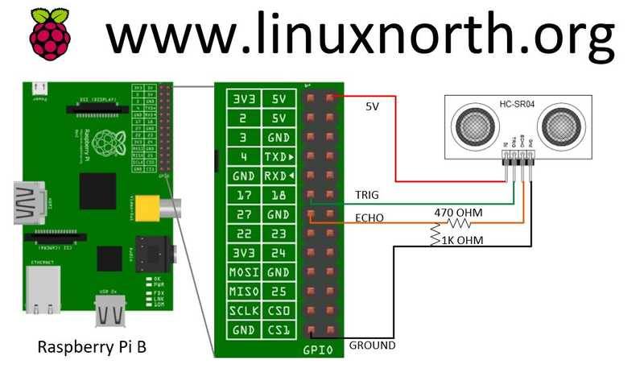
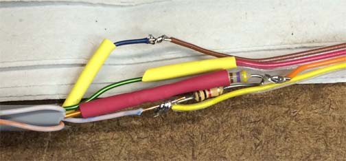
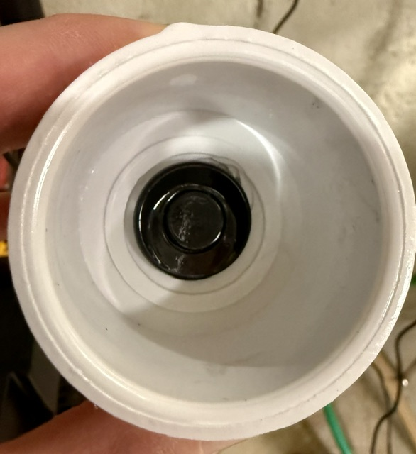
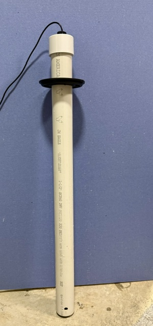
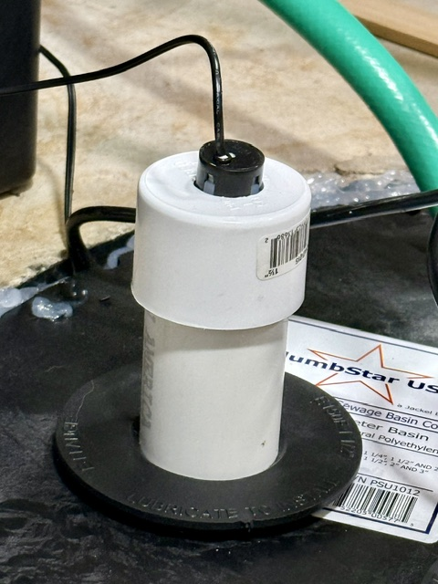

# Hardware

## Supported Sensors

Raspi-Sump works with the **HC-SR04** ultrasonic distance sensor and
compatible variants. For sump pit use, the **JSN-SR04T v2.0** waterproof
version is strongly recommended.

| Sensor | Notes |
|--------|-------|
| HC-SR04 | Standard sensor, not waterproof |
| JSN-SR04T v2.0 | Waterproof, recommended for sump pit use |
| JSN-SR04T v3.0 | **Not compatible** — different protocol |

!!! danger "JSN-SR04T v3.0 — Do not use"
    Version 3.0 uses a different communication protocol and is not compatible
    with Raspi-Sump. Verify the version before purchasing.

---

## Voltage Divider Requirement

The HC-SR04 and JSN-SR04T sensors operate at **5V** and return a 5V signal
on the echo pin. The Raspberry Pi GPIO pins are **3.3V tolerant only** —
a 5V echo signal connected directly will damage your Pi.

A voltage divider on the echo pin is required to reduce the signal to 3.3V.

### Simple Two-Resistor Divider

{ width="600" }

A 470 Ohm and 1K Ohn resitor divides the 5V echo signal to approximately 3.3V.

A 1K Ohm and 2K Ohm would accomplish the same things.  There are many online voltage divider calculators you can use to test various settings.

### Real world example



The 470 Ohm resister is on top and the 1K resistor is on the bot tom. The wires to the right go to the Pi and the ones to the left go to the sensor. The orange wire is the Echo wire and you can see it is connected right at the center of the two connected resistors. The yellow wire goes to Ground on the Pi. 

There are plenty of diagrams online explaining voltage dividers, but this picture provided by github user @rhiller was very helpful to see in practice. 

### Mounting Inside a PVC Pipe

Mounting the JSN-SR04T within a guide pipe **significantly** improves reading precision and reproducibility. This is known as a [stilling well](https://yourelectricalguide.com/2025/04/stilling-well.html), a design borrowed from industrial tank-level sensing.

The pipe acts as a waveguide: it doesn't focus the sound so much as strip away everything except the wave energy traveling nearly parallel to the pipe's axis. The sensor's ultrasonic pulse normally radiates as a wide cone (30°–75° depending on spec/version) that, in a crowded pit, reflects off the walls, the pump, and surrounding pipes, producing false-target echoes. Confined to a pipe, only the near-axial portion of the wavefront survives, traveling straight down the bore to the water and straight back, so the return echo is dominated by one clean, perpendicular reflection instead of a noisy mix of others. As a side benefit, the pipe also calms the water surface it opens onto, which helps since still water reflects specularly rather than diffusely and any ripple would otherwise deflect the echo away from the sensor.

Note that this setup will cause the max distance read to alway be the length of the pipe. This is due to the off-axis wave energy which gets stripped away due to internal reflections off the pipe wall back toward the transducer, arriving out of phase with the direct echo. Destructive interference degrades the return signal enough that the sensor effectively can't range beyond the bottom of the pipe.

In the photos below, a 26" section of 1-1/2" PVC was used together with a corresponding PVC cap. A 7/8" paddle drill bit is the perfect size for the sensor. Friction alone is used to hold the sensor in place.

{ width="400" }

Interior of the mounted sensor in the PVC cap.

{ width="300" }

The finished assembly.

{ width="400" }

The sensor probe is passed through the sump pit cover via a pre-drilled hole which holds it in place.

---

## GPIO Wiring

Any available GPIO pins can be used for trig and echo. The defaults are:

| Signal | Default GPIO | Pi Header Pin |
|--------|-------------|---------------|
| Trig | 17 | Pin 11 |
| Echo | 27 | Pin 13 |
| VCC (5V) | — | Pin 2 or 4 |
| GND | — | Pin 6 |

!!! note "BCM numbering"
    Raspi-Sump uses BCM GPIO numbering, not the physical pin numbers printed
    on the Pi header. Set your chosen pins in `raspisump.conf` under
    `[gpio_pins]`.

!!! Tip "Tip - Use pinsource to test your sensor"
    Test your sensor with the pinsource utility;

    ```
    pinsource -t 17 -e 27
    ```

---

## Sensor Placement

- Mount the sensor at the top of the sump pit, facing downward
- Set `pit_depth` in `raspisump.conf` to the distance from the sensor face
  to the bottom of the pit
- Ensure the sensor has a clear line of sight to the water surface — avoid
  mounting near pipes or walls that could cause false reflections
- The JSN-SR04T v2.0 has a minimum sensing distance of approximately 20cm —
  do not mount closer than this to the maximum expected water level


---

## Recommended Raspberry Pi Models

Raspi-Sump runs on any Raspberry Pi 2 or greater with Raspberry Pi OS Bookworm (v12) or Trixie (v13).
